# Lensor — Tab Capture Pipeline Analysis

> Technical deep-dive into how Lensor captures, processes, and displays screen content.

## Table of Contents

1. [Overview](#overview)
2. [Pipeline Stages](#pipeline-stages)
3. [Memory & Storage](#memory--storage)
4. [The Mermaid Diagram](#the-mermaid-diagram)
5. [Efficiency Concerns & Opportunities](#efficiency-concerns--opportunities)
6. [Expert Questions](#expert-questions)

---

## Overview

Lensor uses Chrome's `tabCapture` API to capture the visible content of a browser tab, then processes and displays a zoomed portion in a canvas-based lens UI. The pipeline involves multiple Web APIs and image representations.

### High-Level Flow

```
User Click → tabCapture API → MediaStream → ImageCapture → ImageBitmap → Canvas
```

### Key Components Involved

| Component              | Location                        | Role                                               |
| ---------------------- | ------------------------------- | -------------------------------------------------- |
| Service Worker         | `service-worker.ts`             | Chrome API access, tabCapture stream ID generation |
| `useMediaCapture`      | `hooks/useMediaCapture.ts`      | MediaStream setup, frame grabbing                  |
| `useLenseCanvasUpdate` | `hooks/useLenseCanvasUpdate.ts` | Canvas drawing, zoom calculation                   |
| `Lense.tsx`            | `features/Lense/Lense.tsx`      | React component orchestrating all hooks            |
| `fisheyegl.ts`         | `lib/fisheyegl.ts`              | WebGL fisheye distortion effect                    |

---

## Pipeline Stages

### Stage 1: Extension Activation

**Trigger**: User clicks the extension icon in Chrome toolbar.

**What happens**:

1. `chrome.action.onClicked` fires in service worker
2. Service worker calls `set({ active: true }, agentKey)` via Crann
3. UI script receives state change, becomes visible

**Code location**: `service-worker.ts` → `handleActionButtonClick()`

---

### Stage 2: MediaStream ID Generation (Service Worker)

**What is a MediaStreamId?**

A `mediaStreamId` is an opaque string token generated by Chrome that authorizes a specific tab to be captured. It's like a one-time-use ticket that says "you can capture this tab."

**How it works**:

```typescript
// In state-config.ts (runs in service worker context)
const mediaStreamId = await chrome.tabCapture.getMediaStreamId({
  consumerTabId: target.tabId, // Who will consume the stream
  targetTabId: target.tabId // What tab to capture
});
```

**Key facts**:

- This is a Chrome Extension API (only available in service worker/background context)
- The ID must be used quickly (has a short expiration)
- Does NOT start recording — just creates the authorization token
- Uses Crann's action/RPC mechanism to pass ID to content script

---

### Stage 3: MediaStream Creation (Content Script)

**What is a MediaStream?**

A `MediaStream` is a Web API object representing a stream of media content — in our case, a live video feed of the tab's visible content. Think of it like plugging a camera into the browser tab.

**How it's created**:

```typescript
// In useMediaCapture.ts
const media = await navigator.mediaDevices.getUserMedia({
  video: {
    mandatory: {
      chromeMediaSource: 'tab',
      chromeMediaSourceId: streamId // The token from Stage 2
    }
  }
});
```

**Memory characteristics**:

- The MediaStream itself is lightweight (just references/handles)
- BUT it starts an active video capture pipeline in the browser
- Chrome shows the "sharing" indicator (blue circle) while active
- **Video data is NOT stored** — it's a live stream, continuously generated

**Storage**: Stored in a React `useRef` (`mediaStreamRef.current`)

---

### Stage 4: ImageCapture Setup

**What is ImageCapture?**

`ImageCapture` is a Web API that provides an interface for capturing still images from a video track. It's like having a "take photo" button on a video camera.

**How it's created**:

```typescript
// In useMediaCapture.ts
const imageCapture = new ImageCapture(media.getVideoTracks()[0]);
```

**Key facts**:

- Created from the video track of the MediaStream
- Lightweight object — just holds a reference to the track
- Provides `grabFrame()` method for capturing images
- Does NOT store any image data itself

**Storage**: Stored in a React `useRef` (`activeImageCaptureRef.current`)

---

### Stage 5: Frame Capture (grabFrame)

**What is grabFrame()?**

The `grabFrame()` method captures a single video frame and returns it as an `ImageBitmap`.

**How it works**:

```typescript
// In useMediaCapture.ts
const rawBitmap = await activeImageCaptureRef.current.grabFrame();
```

**What is an ImageBitmap?**

An `ImageBitmap` is an optimized, GPU-ready image representation. Key characteristics:

| Property     | Details                                                 |
| ------------ | ------------------------------------------------------- |
| **Location** | GPU texture memory (when available) or CPU memory       |
| **Size**     | Width × Height × 4 bytes (RGBA) — at screen resolution! |
| **Example**  | 1920×1080 display ≈ 8.3 MB per frame                    |
| **Lifetime** | Persists until explicitly closed or garbage collected   |

**Important**: The raw bitmap captures the ENTIRE visible tab, not just the lens area.

---

### Stage 6: Black Border Cropping

**Why cropping?**

When the tab dimensions don't match the capture device's aspect ratio, Chrome adds black letterboxing/pillarboxing. We detect and remove this.

**How it works**:

```typescript
// In useMediaCapture.ts
const cropMetrics = calculateImageBlackBorder(rawBitmap);
const processedBitmap = await cropImageBlackBorder(rawBitmap, cropMetrics);
```

**Memory implications**:

1. Original `rawBitmap` exists (8.3 MB example)
2. `createImageBitmap()` creates NEW cropped bitmap (similar size)
3. Original is closed: `sourceBitmap.close()` ✅ Good!

**This is one of the few places where we properly clean up ImageBitmaps.**

---

### Stage 7: React State Storage

**Where is the final ImageBitmap stored?**

```typescript
// In useMediaCapture.ts
const [imageBitmap, setImageBitmap] = useState<ImageBitmap | null>(null);
```

**Lifecycle**:

- Stored in React state as `imageBitmap`
- Replaced on each recapture (scroll, resize, DOM change triggers)
- **Potential issue**: When replaced, old ImageBitmap is NOT explicitly closed!

---

### Stage 8: Canvas Drawing

**The Canvases**

Lensor uses FOUR canvas elements:

| Canvas          | Size    | Purpose                             | Visibility |
| --------------- | ------- | ----------------------------------- | ---------- |
| `mainCanvas`    | 400×400 | Final display (what user sees)      | Visible    |
| `gridCanvas`    | 400×400 | Grid overlay and crosshairs         | Visible    |
| `interCanvas`   | 400×400 | Intermediate for fisheye processing | Hidden     |
| `fisheyeCanvas` | 400×400 | WebGL fisheye output                | Hidden     |

**Drawing flow (fisheye OFF)**:

```typescript
// In useLenseCanvasUpdate.ts
mainCtx.drawImage(
  imageBitmap, // Full-tab ImageBitmap (~1920×1080)
  sourceX,
  sourceY, // Crop position (lens center)
  sourceW,
  sourceH, // Crop size (based on zoom)
  0,
  0, // Destination position
  400,
  400 // Destination size (canvas size)
);
```

**Drawing flow (fisheye ON)**:

```
ImageBitmap → interCanvas → WebGL (fisheyeCanvas) → mainCanvas
```

1. Draw zoomed crop to `interCanvas` (hidden 2D canvas)
2. Upload `interCanvas` to WebGL texture
3. Apply fisheye shader distortion
4. Draw WebGL output to `mainCanvas`

---

### Stage 9: Color Detection

After drawing to `mainCanvas`, we sample the center pixel:

```typescript
// In useLenseCanvasUpdate.ts
const pixel = ctx.getImageData(CANVAS_SIZE / 2, CANVAS_SIZE / 2, 1, 1);
return `rgb(${pixel.data[0]}, ${pixel.data[1]}, ${pixel.data[2]})`;
```

**Memory**: `getImageData()` creates a small `ImageData` object (4 bytes for 1 pixel).

---

## Memory & Storage

### What Gets Stored Where

| Data                  | Type    | Size (estimate) | Storage Location | Lifetime                      |
| --------------------- | ------- | --------------- | ---------------- | ----------------------------- |
| MediaStream           | Handle  | ~few KB         | `useRef`         | Until cleanup/deactivation    |
| ImageCapture          | Handle  | ~few KB         | `useRef`         | Until cleanup/deactivation    |
| Raw ImageBitmap       | GPU/CPU | ~8 MB           | Temporary        | Closed immediately after crop |
| Processed ImageBitmap | GPU/CPU | ~8 MB           | React state      | Until next recapture          |
| Main Canvas           | GPU     | ~640 KB         | DOM              | Component lifetime            |
| Grid Canvas           | GPU     | ~640 KB         | DOM              | Component lifetime            |
| Inter Canvas          | GPU     | ~640 KB         | DOM              | Component lifetime            |
| Fisheye Canvas        | WebGL   | ~640 KB         | DOM              | Component lifetime            |
| WebGL Texture         | GPU     | ~640 KB         | WebGL context    | FisheyeGl instance lifetime   |

### Memory Lifecycle Diagram

```
[Recapture Triggered]
       ↓
[grabFrame() → Raw ImageBitmap] ──→ ~8 MB allocated
       ↓
[cropImageBlackBorder]
       ├── New ImageBitmap created ──→ ~8 MB allocated (briefly have ~16 MB)
       └── Old closed ──→ ~8 MB freed
       ↓
[setImageBitmap(processedBitmap)]
       ├── New bitmap in React state
       └── OLD BITMAP NOT CLOSED! ❌ ──→ Potential leak!
       ↓
[drawImage to canvas]
       └── No new allocations (draws from existing bitmap)
```

---

## The Mermaid Diagram


### Alternative: Flowchart View

```mermaid
flowchart TD
    subgraph Activation
        A[User clicks icon] --> B[Service Worker receives click]
        B --> C[Set active=true via Crann]
        C --> D[UI becomes visible]
    end

    subgraph "Stream Setup"
        D --> E[UI calls getMediaStreamId action]
        E --> F[SW: chrome.tabCapture.getMediaStreamId]
        F --> G[Return mediaStreamId token]
        G --> H[UI: navigator.mediaDevices.getUserMedia]
        H --> I[MediaStream created]
        I --> J[🔴 Chrome recording indicator ON]
        J --> K[new ImageCapture from video track]
    end

    subgraph "Frame Capture"
        K --> L[Wait for rAF - hide lens]
        L --> M[imageCapture.grabFrame]
        M --> N[ImageBitmap ~8MB in GPU memory]
        N --> O{Has letterboxing?}
        O -->|Yes| P[createImageBitmap - crop]
        P --> Q[Close original bitmap ✅]
        O -->|No| R[Use as-is]
        Q --> S[Store in React state]
        R --> S
    end

    subgraph "Canvas Rendering"
        S --> T{Fisheye ON?}
        T -->|No| U[drawImage direct to mainCanvas]
        T -->|Yes| V[drawImage to interCanvas]
        V --> W[WebGL: upload as texture]
        W --> X[Apply fisheye shader]
        X --> Y[Draw fisheyeCanvas to mainCanvas]
        U --> Z[getImageData - sample center pixel]
        Y --> Z
        Z --> AA[Update color palettes]
    end

    subgraph "Recapture Loop"
        AA --> BB{Page changed?}
        BB -->|Scroll/Resize/DOM| CC[Trigger recapture]
        CC --> L
        BB -->|No| DD[Wait for user interaction]
        DD --> BB
    end

    style J fill:#ff6b6b
    style Q fill:#51cf66
```



---

## Efficiency Concerns & Opportunities

### 1. MediaStream Stays Open Continuously

**Current behavior**: We create a MediaStream and keep it open for the entire session, even though we only grab single frames periodically.

**Why this matters**:

- Chrome shows recording indicator the entire time
- Browser maintains video encoding/decoding pipeline
- Continuous resource consumption even when idle

**Potential fix**: Use `chrome.tabs.captureVisibleTab()` instead for single-frame captures. This:

- Returns a data URL or Blob of a single screenshot
- No persistent MediaStream
- No recording indicator
- Works synchronously for our use case

**Trade-off**: Slightly slower per-capture, but eliminates ongoing overhead.

### 2. ImageBitmap Not Closed on Replacement

**Current behavior** (in `useMediaCapture.ts`):

```typescript
setImageBitmap(processedBitmap); // Old bitmap just... disappears
```

**The problem**: When React state updates, the old ImageBitmap reference is lost but may not be garbage collected immediately. GPU memory can leak.

**Fix**:

```typescript
// Before setting new bitmap
if (imageBitmap) {
  imageBitmap.close();
}
setImageBitmap(processedBitmap);
```

### 3. Unnecessary Canvases When Fisheye Off

**Current behavior**: All 4 canvases exist in DOM regardless of fisheye state.

**Opportunity**: Lazy-create `interCanvas` and `fisheyeCanvas` only when fisheye is enabled.

### 4. Full-Tab ImageBitmap for Small Lens

**Current behavior**: We capture the entire tab (~8MB) but only display a 400×400 zoomed portion.

**The math**:

- Tab: 1920×1080 = 2,073,600 pixels × 4 bytes = 8.3 MB
- Lens displays: ~100×100 to ~800×800 pixels depending on zoom
- We're storing 10-100× more than we display!

**Potential optimization**: Crop the ImageBitmap immediately to only the area around the lens position, plus some buffer for drag movement.

### 5. Recapture on Every DOM Mutation

**Current behavior**: Any DOM mutation above threshold triggers a full recapture.

**Problem**: Modern web apps mutate DOM frequently (animations, real-time updates).

**Opportunity**:

- Smarter mutation filtering (ignore animations, ignore non-visible changes)
- Debounce more aggressively
- Consider a "freeze" mode that disables auto-recapture

---

## Expert Questions

These are questions an expert in browser media APIs or graphics would ask:

### About the MediaStream Approach

1. **Why use a continuous stream for single-frame capture?**

   - Could `chrome.tabs.captureVisibleTab()` eliminate the recording indicator entirely?
   - What's the latency difference between the two approaches?

2. **Are we calling `track.stop()` correctly on cleanup?**

   - Current code does call it, but only when `active` becomes false
   - What if the component unmounts without active changing?

3. **Could we use `OffscreenCanvas` for background processing?**
   - Would allow moving canvas operations off the main thread
   - Potentially smoother UI during recaptures

### About Memory Management

4. **Are we creating ImageBitmap leaks?**

   - Old bitmaps should be explicitly `.close()`d before replacement
   - GPU memory may not be freed promptly otherwise

5. **What's our peak memory usage during recapture?**

   - Briefly have two full-tab ImageBitmaps in memory
   - Could be ~16MB spike on high-resolution displays

6. **Should we use WeakRef for the ImageBitmap?**
   - Would allow garbage collection if memory pressure
   - Need fallback for when ref is collected

### About Rendering Performance

7. **Is the fisheye path creating unnecessary copies?**

   - ImageBitmap → interCanvas → WebGL texture → fisheyeCanvas → mainCanvas
   - That's 4 copies of the zoomed area!
   - Could WebGL read directly from ImageBitmap?

8. **Are we properly using `createImageBitmap` options?**

   - `resizeWidth`/`resizeHeight` could do scaling on decode
   - Might be faster than canvas scaling

9. **Should the grid be a CSS overlay instead of a canvas?**
   - SVG or CSS grid pattern might be more efficient
   - No redraw needed on pan

### About the Capture API

10. **What's the actual frame rate of our MediaStream?**

    - We don't specify constraints, so it might be capturing at 30/60fps
    - We only use 1 frame per capture cycle
    - Could we request lower frame rate to save resources?

11. **Does `grabFrame()` wait for a new frame?**
    - Or does it return the last captured frame immediately?
    - Timing relative to `requestAnimationFrame` matters

---

## Summary

The current pipeline is functional but has room for efficiency improvements:

| Issue                                       | Severity | Effort to Fix       |
| ------------------------------------------- | -------- | ------------------- |
| MediaStream always on (recording indicator) | High     | Medium (API change) |
| ImageBitmap not closed on replace           | Medium   | Low                 |
| Full-tab bitmap for small lens              | Medium   | Medium              |
| Aggressive recapture triggers               | Low      | Medium              |
| Unnecessary canvases when no fisheye        | Low      | Low                 |

**Recommended first steps**:

1. Add `imageBitmap.close()` before state replacement (quick win)
2. Investigate `chrome.tabs.captureVisibleTab()` as alternative approach
3. Profile actual memory usage with Chrome DevTools Memory tab
