# Lensor — Tab Capture Pipeline

> Technical deep-dive into how Lensor captures, processes, and displays screen content.

## Table of Contents

1. [Overview](#overview)
2. [Pipeline Stages](#pipeline-stages)
3. [Memory & Storage](#memory--storage)
4. [The Mermaid Diagram](#the-mermaid-diagram)
5. [Remaining Optimization Opportunities](#remaining-optimization-opportunities)
6. [Historical Note: The Old Approach](#historical-note-the-old-approach)

---

## Overview

Lensor uses Chrome's `chrome.tabs.captureVisibleTab()` API to capture single screenshots of the visible tab content, then processes and displays a zoomed portion in a canvas-based lens UI.

### High-Level Flow

```
User Click → captureVisibleTab → Data URL → ImageBitmap → Canvas
```

### Why This Approach?

We chose `captureVisibleTab` over the alternative `tabCapture` API because:

| Aspect              | captureVisibleTab ✅ | tabCapture ❌                |
| ------------------- | -------------------- | ---------------------------- |
| Recording indicator | None                 | 🔴 Persistent blue circle    |
| Resource usage      | On-demand only       | Continuous video stream      |
| Permissions         | `activeTab`          | `tabCapture` (more invasive) |
| Complexity          | Simple data URL      | MediaStream + ImageCapture   |

### Key Components Involved

| Component              | Location                        | Role                                         |
| ---------------------- | ------------------------------- | -------------------------------------------- |
| Service Worker         | `service-worker.ts`             | Chrome API access, `captureVisibleTab` calls |
| `useMediaCapture`      | `hooks/useMediaCapture.ts`      | Screenshot capture, ImageBitmap conversion   |
| `useLenseCanvasUpdate` | `hooks/useLenseCanvasUpdate.ts` | Canvas drawing, zoom calculation             |
| `Lense.tsx`            | `features/Lense/Lense.tsx`      | React component orchestrating all hooks      |
| `fisheyegl.ts`         | `lib/fisheyegl.ts`              | WebGL fisheye distortion effect              |

---

## Pipeline Stages

### Stage 1: Extension Activation

**Trigger**: User clicks the extension icon in Chrome toolbar.

**What happens**:

1. `chrome.action.onClicked` fires in service worker
2. Service worker calls `set({ active: true }, agentKey)` via Crann
3. UI script receives state change, becomes visible
4. `useMediaCapture` hook auto-captures first frame

**Code location**: `service-worker.ts` → `handleActionButtonClick()`

---

### Stage 2: Tab Screenshot (Service Worker)

**What is `captureVisibleTab`?**

A Chrome Extension API that takes a single screenshot of the currently visible tab area. It returns a data URL (base64-encoded PNG or JPEG).

**How it works**:

```typescript
// In state-config.ts (captureTab action, runs in service worker)
const tab = await chrome.tabs.get(target.tabId);
const dataUrl = await chrome.tabs.captureVisibleTab(tab.windowId, {
  format: 'png'
});
return dataUrl;
```

**Key facts**:

- Returns a data URL string (e.g., `data:image/png;base64,iVBOR...`)
- Captures only the visible viewport (not scrolled content)
- No persistent stream or recording indicator
- Rate limited to 2 calls per second by Chrome
- Requires `activeTab` permission

**What gets captured**: The exact pixels visible in the browser viewport at that moment.

---

### Stage 3: Data URL to ImageBitmap (Content Script)

**The conversion process**:

The data URL from `captureVisibleTab` must be converted to an `ImageBitmap` for efficient canvas drawing.

```typescript
// In useMediaCapture.ts
async function dataUrlToImageBitmap(dataUrl: string): Promise<ImageBitmap> {
  return new Promise((resolve, reject) => {
    const img = new Image();
    img.onload = async () => {
      const bitmap = await createImageBitmap(img);
      resolve(bitmap);
    };
    img.onerror = () => reject(new Error('Failed to load image'));
    img.src = dataUrl;
  });
}
```

**Memory implications**:

1. Data URL string: ~10-15 MB for a 1080p PNG (base64 encoding adds ~33% overhead)
2. Image element: Temporary, garbage collected after bitmap creation
3. ImageBitmap: ~8 MB (uncompressed RGBA in GPU memory)

**Important**: The Image element and data URL are short-lived. Only the ImageBitmap persists.

---

### Stage 4: Black Border Cropping

**Why cropping?**

When the tab dimensions don't exactly match the display's pixel ratio, Chrome may add black letterboxing or pillarboxing. We detect and remove this.

**How it works**:

```typescript
// In useMediaCapture.ts
const cropMetrics = calculateImageBlackBorder(rawBitmap);
const processedBitmap = await cropImageBlackBorder(rawBitmap, cropMetrics);
```

**Memory management** (properly handled ✅):

1. Original `rawBitmap` exists (~8 MB)
2. `createImageBitmap()` creates cropped bitmap (~8 MB) — briefly ~16 MB total
3. Original is explicitly closed: `sourceBitmap.close()` — back to ~8 MB

---

### Stage 5: React State Storage

**Where is the final ImageBitmap stored?**

```typescript
// In useMediaCapture.ts
const [imageBitmap, setImageBitmap] = useState<ImageBitmap | null>(null);
```

**Memory management** (properly handled ✅):

```typescript
// Before setting new bitmap, close the old one
if (currentBitmapRef.current) {
  currentBitmapRef.current.close();
}
currentBitmapRef.current = processedBitmap;
setImageBitmap(processedBitmap);
```

We use a ref to track the current bitmap so we can explicitly close it before replacement, preventing memory leaks.

---

### Stage 6: Canvas Drawing

**The Canvases**

Lensor uses FOUR canvas elements:

| Canvas          | Size    | Purpose                             | Visibility |
| --------------- | ------- | ----------------------------------- | ---------- |
| `mainCanvas`    | 400×400 | Final display (what user sees)      | Visible    |
| `gridCanvas`    | 400×400 | Grid overlay and crosshairs         | Visible    |
| `interCanvas`   | 400×400 | Intermediate for fisheye processing | Hidden     |
| `fisheyeCanvas` | 400×400 | WebGL fisheye output                | Hidden     |

**Drawing flow (fisheye OFF)**:

```typescript
// In useLenseCanvasUpdate.ts
mainCtx.drawImage(
  imageBitmap, // Full-tab ImageBitmap
  sourceX,
  sourceY, // Crop position (lens center)
  sourceW,
  sourceH, // Crop size (based on zoom level)
  0,
  0, // Destination position
  400,
  400 // Destination size (canvas size)
);
```

**Drawing flow (fisheye ON)**:

```
ImageBitmap → interCanvas → WebGL (fisheyeCanvas) → mainCanvas
```

1. Draw zoomed crop to `interCanvas` (hidden 2D canvas)
2. Upload `interCanvas` to WebGL texture
3. Apply fisheye shader distortion
4. Draw WebGL output to `mainCanvas`

---

### Stage 7: Color Detection

After drawing to `mainCanvas`, we sample the center pixel:

```typescript
// In useLenseCanvasUpdate.ts
const pixel = ctx.getImageData(CANVAS_SIZE / 2, CANVAS_SIZE / 2, 1, 1);
return `rgb(${pixel.data[0]}, ${pixel.data[1]}, ${pixel.data[2]})`;
```

**Memory**: `getImageData()` creates a small `ImageData` object (4 bytes for 1 pixel).

---

## Memory & Storage

### What Gets Stored Where

| Data                  | Type    | Size (estimate) | Storage Location  | Lifetime                    |
| --------------------- | ------- | --------------- | ----------------- | --------------------------- |
| Data URL (temporary)  | String  | ~12 MB          | JS heap           | Until ImageBitmap created   |
| Raw ImageBitmap       | GPU/CPU | ~8 MB           | Temporary         | Closed after crop           |
| Processed ImageBitmap | GPU/CPU | ~8 MB           | React state + ref | Until next recapture        |
| Main Canvas           | GPU     | ~640 KB         | DOM               | Component lifetime          |
| Grid Canvas           | GPU     | ~640 KB         | DOM               | Component lifetime          |
| Inter Canvas          | GPU     | ~640 KB         | DOM               | Component lifetime          |
| Fisheye Canvas        | WebGL   | ~640 KB         | DOM               | Component lifetime          |
| WebGL Texture         | GPU     | ~640 KB         | WebGL context     | FisheyeGl instance lifetime |

### Memory Lifecycle Diagram

```
[Recapture Triggered]
       ↓
[captureVisibleTab() → Data URL] ──→ ~12 MB string (temporary)
       ↓
[dataUrlToImageBitmap()]
       ├── Image element created (temporary)
       └── createImageBitmap() ──→ ~8 MB GPU memory
       ↓
[cropImageBlackBorder()]
       ├── New cropped bitmap ──→ ~8 MB (briefly ~16 MB total)
       └── Original closed ✅ ──→ ~8 MB freed
       ↓
[setImageBitmap()]
       ├── Close old bitmap ✅ ──→ Previous ~8 MB freed
       └── Store new bitmap ──→ ~8 MB persists
       ↓
[drawImage to canvas]
       └── No new allocations (draws from existing bitmap)
```

**Peak memory during recapture**: ~24 MB briefly (data URL + 2 ImageBitmaps), then settles to ~8 MB.

---

## The Mermaid Diagram

```mermaid
sequenceDiagram
    participant User
    participant SW as Service Worker
    participant Crann as Crann State
    participant UI as Content Script (React)
    participant Chrome as Chrome APIs
    participant Canvas as Canvas Elements

    User->>SW: Click extension icon
    activate SW
    SW->>Crann: set({ active: true })
    Crann-->>UI: active state change
    activate UI

    UI->>Crann: callAction('captureTab')
    Crann->>SW: RPC: captureTab
    SW->>Chrome: tabs.captureVisibleTab()
    Note over Chrome: ✅ No recording indicator!
    Chrome-->>SW: Data URL (PNG)
    SW-->>Crann: return dataUrl
    Crann-->>UI: dataUrl

    UI->>UI: new Image().src = dataUrl
    UI->>UI: createImageBitmap(img)
    UI->>UI: calculateImageBlackBorder()
    UI->>UI: cropImageBlackBorder()
    UI->>UI: Close old bitmap ✅
    UI->>UI: setImageBitmap(cropped)

    loop On each render / drag / zoom
        UI->>Canvas: mainCtx.drawImage(bitmap, crop, dest)
        alt Fisheye ON
            UI->>Canvas: interCtx.drawImage()
            Canvas->>Canvas: WebGL: setCanvasSource()
            Canvas->>Canvas: mainCtx.drawImage(fisheyeCanvas)
        end
        UI->>Canvas: getImageData(center pixel)
        Canvas-->>UI: RGB color
    end

    Note over UI,Canvas: Page scroll/resize/mutation detected
    UI->>Crann: callAction('captureTab')
    Note over UI: New capture cycle begins

    deactivate UI
    deactivate SW
```



### Flowchart View

```mermaid
flowchart TD
    subgraph Activation["🖱️ Extension Activation"]
        A[User clicks icon] --> B[Service Worker receives click]
        B --> C[Set active=true via Crann]
        C --> D[UI becomes visible]
    end

    subgraph Capture["📸 Tab Capture"]
        D --> E[UI calls captureTab action]
        E --> F[SW: chrome.tabs.captureVisibleTab]
        F --> G[Return data URL ~12MB]
        G --> H[Convert to ImageBitmap ~8MB]
    end

    subgraph Processing["⚙️ Processing"]
        H --> I{Has black borders?}
        I -->|Yes| J[Crop borders]
        J --> K[Close original bitmap ✅]
        I -->|No| L[Use as-is]
        K --> M[Close old state bitmap ✅]
        L --> M
        M --> N[Store in React state]
    end

    subgraph Rendering["🎨 Canvas Rendering"]
        N --> O{Fisheye ON?}
        O -->|No| P[drawImage to mainCanvas]
        O -->|Yes| Q[drawImage to interCanvas]
        Q --> R[WebGL fisheye shader]
        R --> S[Draw to mainCanvas]
        P --> T[Sample center pixel]
        S --> T
        T --> U[Update color palettes]
    end

    subgraph Recapture["🔄 Recapture Loop"]
        U --> V{Page changed?}
        V -->|Scroll/Resize/DOM| W[Trigger recapture]
        W --> E
        V -->|No| X[Wait for interaction]
        X --> V
    end

    style F fill:#51cf66,color:#000
    style K fill:#51cf66,color:#000
    style M fill:#51cf66,color:#000
```



---

## Remaining Optimization Opportunities

With the switch to `captureVisibleTab`, we've addressed the main efficiency concern (no more recording indicator). Here are remaining opportunities:

### 1. Full-Tab ImageBitmap for Small Lens

**Current behavior**: We capture the entire tab (~8MB) but only display a 400×400 zoomed portion.

**The math**:

- Tab: 1920×1080 = 2,073,600 pixels × 4 bytes = 8.3 MB
- Lens displays: ~100×100 to ~800×800 pixels depending on zoom
- We're storing 10-100× more than we display!

**Potential optimization**: Crop the ImageBitmap immediately to only the area around the lens position, plus some buffer for drag movement. Trade-off: Would need to recapture more often when dragging near edges.

### 2. Unnecessary Canvases When Fisheye Off

**Current behavior**: All 4 canvases exist in DOM regardless of fisheye state.

**Opportunity**: Lazy-create `interCanvas` and `fisheyeCanvas` only when fisheye is enabled.

### 3. Aggressive Recapture Triggers

**Current behavior**: Any DOM mutation above threshold triggers a full recapture.

**Problem**: Modern web apps mutate DOM frequently (animations, real-time updates).

**Opportunity**:

- Smarter mutation filtering (ignore animations, ignore non-visible changes)
- Debounce more aggressively
- Consider a "freeze" mode that disables auto-recapture

### 4. Rate Limiting Awareness

**Chrome's limit**: `captureVisibleTab` is limited to 2 calls per second.

**Current handling**: We debounce recapture triggers (500ms), which keeps us under the limit.

**Opportunity**: If rapid scrolling, queue captures and take the latest rather than dropping them.

---

## Historical Note: The Old Approach

Prior to version 1.0.2, Lensor used the `tabCapture` API with a persistent MediaStream:

```
Old: tabCapture → MediaStream → ImageCapture → grabFrame() → ImageBitmap
New: captureVisibleTab → Data URL → ImageBitmap
```

**Why we changed**:

1. **Recording indicator**: The MediaStream approach caused Chrome to display a persistent blue "recording" indicator, which was confusing for users.

2. **Complexity**: The old approach required managing MediaStream lifecycle, ImageCapture objects, and track cleanup.

3. **Resource usage**: A continuous video stream consumed resources even when idle.

**Trade-offs of the new approach**:

- Each capture requires a new API call (slightly slower per-capture)
- Rate limited to 2 captures per second
- Must convert from data URL to ImageBitmap (small CPU cost)

For our use case (periodic screenshots, not continuous video), the new approach is clearly better.

---

## Summary

The current pipeline is clean and efficient:

| Aspect                   | Status                            |
| ------------------------ | --------------------------------- |
| Recording indicator      | ✅ None (captureVisibleTab)       |
| ImageBitmap memory leaks | ✅ Properly closed on replacement |
| Peak memory usage        | ~24 MB briefly during recapture   |
| Steady-state memory      | ~8 MB (single ImageBitmap)        |
| Rate limiting            | ✅ Handled by debouncing          |

**Remaining optimization opportunities** (low priority):

1. Crop ImageBitmap to lens area only
2. Lazy-create fisheye canvases
3. Smarter DOM mutation filtering
